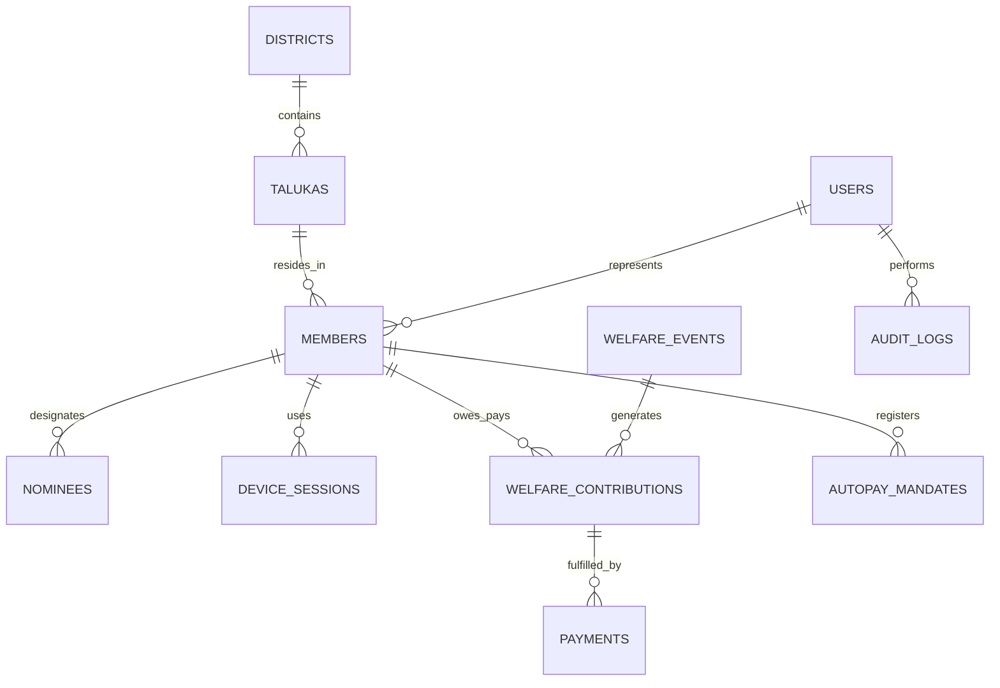

# KPA Welfare Management System — Database Schema Reference

PostgreSQL 16 relational database schema optimized for 1,000,000+ members and millions of financial contribution records.

---

### Core Tables Specification

#### 1. `districts`
| Column | Type | Constraints | Description |
| :--- | :--- | :--- | :--- |
| `id` | UUID | PRIMARY KEY, DEFAULT gen_random_uuid() | District unique identifier |
| `name_en` | VARCHAR(100) | NOT NULL, UNIQUE | District name in English (e.g., 'Bengaluru Urban') |
| `name_kn` | VARCHAR(100) | NOT NULL | District name in Kannada (e.g., 'ಬೆಂಗಳೂರು ನಗರ') |
| `code` | VARCHAR(10) | NOT NULL, UNIQUE | Short code (e.g., 'BLR-U') |
| `created_at` | TIMESTAMPTZ | DEFAULT now() | Record creation timestamp |

#### 2. `talukas`
| Column | Type | Constraints | Description |
| :--- | :--- | :--- | :--- |
| `id` | UUID | PRIMARY KEY, DEFAULT gen_random_uuid() | Taluka unique identifier |
| `district_id` | UUID | NOT NULL, REFERENCES districts(id) | Parent district foreign key |
| `name_en` | VARCHAR(100) | NOT NULL | Taluka name in English |
| `name_kn` | VARCHAR(100) | NOT NULL | Taluka name in Kannada |
| `code` | VARCHAR(10) | NOT NULL | Short code |

#### 3. `users` & `members`
| Column | Type | Constraints | Description |
| :--- | :--- | :--- | :--- |
| `id` | UUID | PRIMARY KEY | User unique identifier |
| `phone` | VARCHAR(15) | NOT NULL, UNIQUE | Mobile phone number (E.164) |
| `role` | VARCHAR(30) | NOT NULL | STATE_HEAD, DISTRICT_ADMIN, TALUKA_ADMIN, MEMBER |
| `district_id` | UUID | NULL, REFERENCES districts(id) | Geographic scope |
| `taluka_id` | UUID | NULL, REFERENCES talukas(id) | Geographic scope |
| `is_active` | BOOLEAN | DEFAULT TRUE | Account active flag |
| `membership_no`| VARCHAR(20) | NULL, UNIQUE | Formatted KPA-DIST-XXXXXX ID |
| `status` | VARCHAR(20) | DEFAULT 'PENDING' | PENDING, APPROVED, REJECTED, SUSPENDED |
| `kyc_verified` | BOOLEAN | DEFAULT FALSE | KYC document verification status |
| `photo_url` | TEXT | NULL | Profile photo storage URL |
| `id_card_qr` | TEXT | NULL | Digital card verification QR payload |

#### 4. `welfare_events`
| Column | Type | Constraints | Description |
| :--- | :--- | :--- | :--- |
| `id` | UUID | PRIMARY KEY | Event unique identifier |
| `deceased_member_id` | UUID | NOT NULL, REFERENCES members(id) | Deceased member reference |
| `title` | VARCHAR(255) | NOT NULL | Event title |
| `death_date` | DATE | NOT NULL | Date of demise |
| `target_amount` | NUMERIC(12,2)| NOT NULL | Calculated assistance target |
| `collected_amount` | NUMERIC(12,2)| DEFAULT 0.00 | Real-time collected aggregate |
| `status` | VARCHAR(20) | DEFAULT 'ACTIVE' | ACTIVE, CLOSED, DISBURSED |
| `created_by` | UUID | NOT NULL, REFERENCES users(id) | Creator (must be STATE_HEAD) |
| `created_at` | TIMESTAMPTZ | DEFAULT now() | Created timestamp |

#### 5. `welfare_contributions`
| Column | Type | Constraints | Description |
| :--- | :--- | :--- | :--- |
| `id` | UUID | PRIMARY KEY | Ledger contribution identifier |
| `event_id` | UUID | NOT NULL, REFERENCES welfare_events(id) | Welfare event reference |
| `member_id` | UUID | NOT NULL, REFERENCES members(id) | Contributing member reference |
| `amount` | NUMERIC(8,2) | DEFAULT 10.00 | Mandatory fixed contribution (₹10.00) |
| `status` | VARCHAR(20) | DEFAULT 'PENDING' | PENDING, SUCCESS, FAILED, EXEMPT |
| `payment_method` | VARCHAR(20) | NULL | AUTOPAY, MANUAL_UPI, WALLET |
| `paid_at` | TIMESTAMPTZ | NULL | Timestamp of payment completion |
| **UNIQUE** | `(event_id, member_id)` | UNIQUE CONSTRAINT | Enforces strict debit idempotency |

#### 6. `payments`
| Column | Type | Constraints | Description |
| :--- | :--- | :--- | :--- |
| `id` | UUID | PRIMARY KEY | Internal payment identifier |
| `contribution_id` | UUID | NULL, REFERENCES welfare_contributions(id) | Related contribution |
| `gateway_order_id` | VARCHAR(100) | NOT NULL, UNIQUE | Razorpay order_id |
| `gateway_payment_id` | VARCHAR(100) | NULL, UNIQUE | Razorpay payment_id |
| `amount` | NUMERIC(10,2)| NOT NULL | Amount in INR |
| `status` | VARCHAR(30) | NOT NULL | CREATED, AUTHORIZED, CAPTURED, FAILED |
| `raw_webhook_payload`| JSONB | NULL | Full gateway audit payload |

#### 7. `autopay_mandates`
| Column | Type | Constraints | Description |
| :--- | :--- | :--- | :--- |
| `id` | UUID | PRIMARY KEY | Mandate record ID |
| `member_id` | UUID | NOT NULL, REFERENCES members(id) | Member ID |
| `gateway_subscription_id` | VARCHAR(100) | NOT NULL, UNIQUE | Gateway recurring mandate identifier |
| `max_amount` | NUMERIC(8,2) | DEFAULT 500.00 | Approved mandate cap per debit |
| `status` | VARCHAR(30) | NOT NULL | CREATED, ACTIVE, PAUSED, CANCELLED |

#### 8. `audit_logs`
| Column | Type | Constraints | Description |
| :--- | :--- | :--- | :--- |
| `id` | BIGSERIAL | PRIMARY KEY | Monotonic sequence ID |
| `user_id` | UUID | NULL, REFERENCES users(id) | Actor user ID |
| `action` | VARCHAR(100) | NOT NULL | Action key (e.g., 'MEMBER_APPROVED') |
| `resource_type` | VARCHAR(50) | NOT NULL | Target table/entity |
| `resource_id` | VARCHAR(100) | NOT NULL | Entity ID |
| `payload` | JSONB | NULL | Before/after state snapshot |
| `ip_address` | INET | NULL | Client IP address |
| `created_at` | TIMESTAMPTZ | DEFAULT now() | Tamper-evident timestamp |
